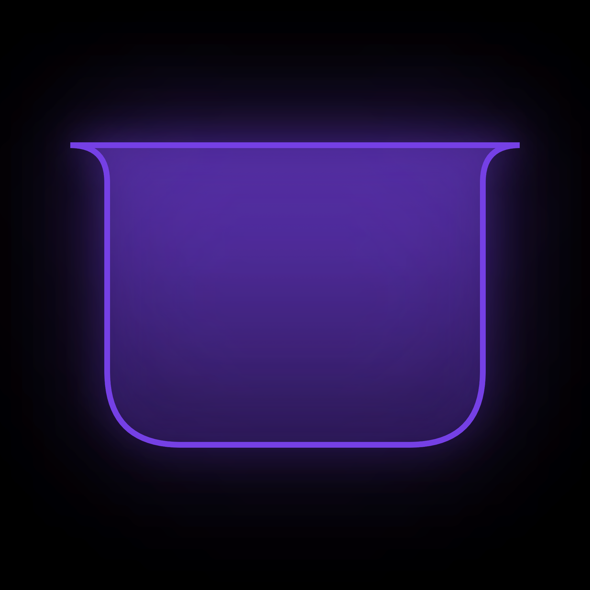
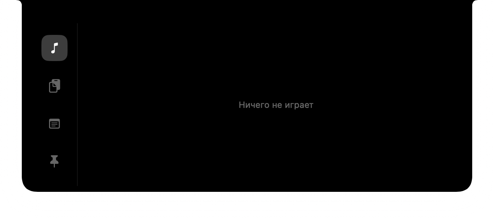
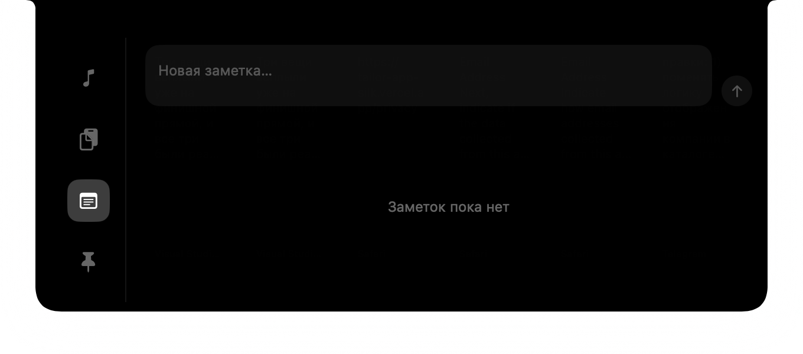
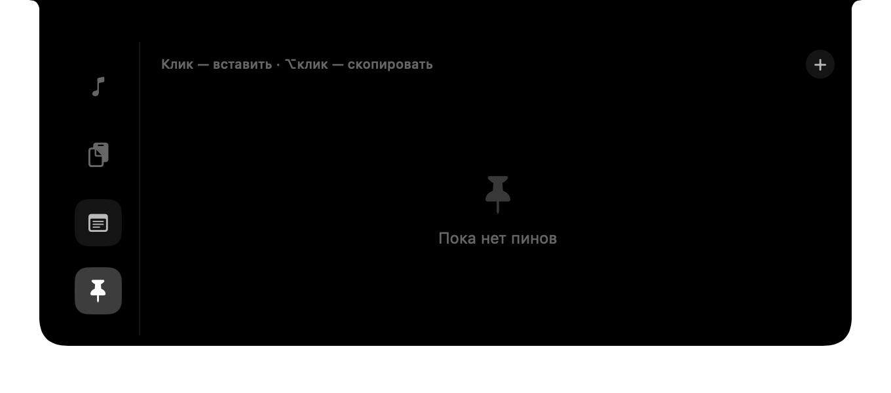

<p align="center">
  
</p>

<h1 align="center">Notchka</h1>

<p align="center">
  Чёлка MacBook как интерактивная панель: музыка из любого источника, история буфера обмена,
  быстрые заметки и закреплённые сниппеты — в одном месте, без единого сетевого запроса.
</p>

<p align="center">
  
</p>

<p align="center">
  
</p>

## Возможности

- **Музыка из любого источника** — Apple Music, Spotify, YouTube в браузере: пауза,
  переключение треков, обложка и прогресс — без установки расширений.
- **История буфера обмена** — текст, изображения, файлы с указанием источника.
  Копирование из менеджеров паролей в ленту не попадает.
- **Быстрые заметки** — короткий текст под рукой, без отдельного приложения.
- **Закреплённые сниппеты** — почта, номер телефона и другие часто вставляемые значения,
  с маскировкой чувствительных полей. Клик вставляет значение в активное приложение,
  `⌥`+клик — только копирует.
- **Общий поиск** — один запрос находит запись из буфера, заметку и пин одновременно.
- **Наведение или хоткей** — `⌥Space` раскрывает панель из любого места; наведение курсора
  на чёлку показывает превью без клика.

Панель — не постоянно висящее окно: она живёт поверх физического выреза экрана и
раскрывается только когда нужна. В остальное время не потребляет заметного CPU.

<p align="center">
  
  
</p>

## Установка

1. Скачайте последний `Notchka-x.y.z.dmg` со страницы [Releases](../../releases).
2. Откройте DMG и перетащите `Notchka.app` в `Applications`.
3. Запустите Notchka из Applications. Значка в Dock не будет — это фоновое
   приложение-агент, оно живёт только в области чёлки.

Сборка подписана Developer ID и нотаризована Apple, поэтому Gatekeeper открывает её без
дополнительных шагов.

### Разрешение Accessibility

При первом клике по закреплённому сниппету или записи буфера macOS попросит разрешение
**Accessibility** — оно нужно ровно для одного действия: программной вставки (`⌘V`) в
активное приложение. Без этого разрешения вставка недоступна, но копирование в буфер
работает как обычно — Notchka объяснит это прямо в интерфейсе со ссылкой на нужный раздел
System Settings.

Наведение на чёлку и глобальный хоткей `⌥Space` разрешений не требуют.

## Приватность

- Notchka не делает ни одного сетевого запроса. Ни телеметрии, ни аналитики, ни проверки
  обновлений.
- Все данные — история буфера, заметки, пины — хранятся локально в
  `~/Library/Application Support/kz.mobilefirst.notchka/notch.sqlite` (SQLite, без
  шифрования — файл защищён только правами доступа файловой системы уровня пользователя).
- Счётчик скачиваний DMG, который виден на странице релизов, считает GitHub на своей
  стороне — приложение об этом ничего не знает и никак в этом не участвует.

## Сборка из исходников

Требования: macOS 26+, Xcode 26.6+, [XcodeGen](https://github.com/yonaskolb/XcodeGen).

```bash
git clone https://github.com/<org>/notchka.git
cd notchka
xcodegen generate
open Notchka.xcodeproj
```

Проект собирается и без личной подписи (ad-hoc по умолчанию в `project.yml`) — подходит
для чтения кода и локальных правок. Для стабильной локальной подписи (важно для того,
чтобы разрешение Accessibility не запрашивалось заново после каждой пересборки) передайте
свою идентичность аргументами сборки:

```bash
xcodebuild -project Notchka.xcodeproj -scheme Notchka \
  CODE_SIGN_IDENTITY="Apple Development" DEVELOPMENT_TEAM=<your-team-id> build
```

### Сборка DMG

```bash
CODE_SIGN_IDENTITY="Developer ID Application: Имя (TEAMID)" \
DEVELOPMENT_TEAM=<TEAMID> \
NOTARIZE=1 NOTARY_KEYCHAIN_PROFILE=<profile> \
./scripts/build-dmg.sh
```

Без `NOTARIZE=1` скрипт соберёт DMG с ad-hoc или указанной подписью, но без нотаризации —
подходит для локальной проверки, не для публичной раздачи.

## Лицензия

MIT — см. [LICENSE](LICENSE). Сторонние зависимости и их лицензии перечислены в
[THIRD_PARTY_LICENSES.md](THIRD_PARTY_LICENSES.md) (GRDB.swift, mediaremote-adapter).
